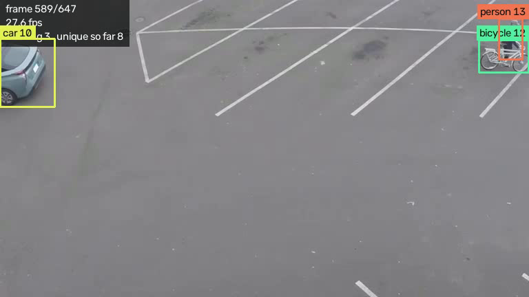
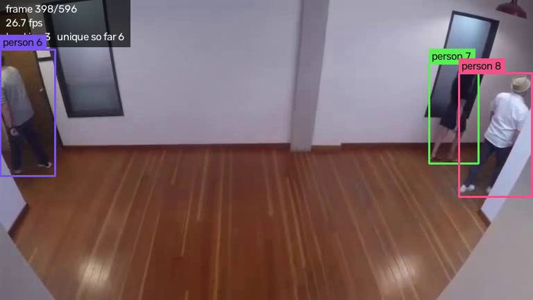

# CodeAlpha_ObjectDetection

**CodeAlpha Artificial Intelligence Internship, Task 4: Object Detection and Tracking**

Detects objects in a webcam feed or video file and tracks each one across frames,
so every object keeps a stable ID for as long as it stays in view.

The tracker is **SORT, implemented in this repository** rather than imported. The
Kalman filter and the Hungarian matching are written out in `sort_tracker.py`, which
is where the interesting part of this task lives.



*Three classes tracked simultaneously. Each ID keeps its own colour for its whole
life, so a track is recognisable at a glance without reading the number.*



*Six unique people have passed through by this frame, three are in view. The
overlay reports the frame number, the measured frame rate, how many objects are
currently tracked, and how many distinct objects have been seen in total.*

## The problem tracking solves

A detector has no memory. Run YOLO on frame 10 and it reports "there is a person
here". Run it on frame 11 and it reports "there is a person here" again, with no
notion that this is the same person. Detection alone gives you boxes that flicker
independently every frame.

Tracking supplies the missing link, and the ID drawn on each box is the visible
result. It is what turns "3 people were detected in this frame" into "3 people
walked through, and here is where each of them went".

## How it works

Each frame goes through four steps:

```
        frame
          |
          |  1. DETECT      YOLOv8 finds objects, returns boxes + classes
          v
  [person 0.91, person 0.87, car 0.76]
          |
          |  2. PREDICT     each existing track guesses where it should be now,
          v                 using the velocity its Kalman filter has learned
  [track 3 -> (410, 220), track 5 -> (88, 260)]
          |
          |  3. ASSOCIATE   match detections to predictions by box overlap,
          v                 choosing the best total pairing
  det 0 -> track 3,  det 1 -> track 5,  det 2 -> new track
          |
          |  4. UPDATE      correct matched tracks, start tracks for new
          v                 objects, retire tracks that have gone missing
  draw "person 3", "person 5", "car 6"
```

**Detect** (`detector.py`). YOLOv8n, pre-trained on COCO. One forward pass per
frame gives boxes, class labels and confidence scores. The model is used as-is:
training a detector from scratch needs a labelled dataset, a GPU and days of
compute to land somewhere worse than the published weights.

**Predict** (`sort_tracker.py`). Each track carries a Kalman filter with state
`[cx, cy, area, ratio, d_cx, d_cy, d_area]`, a constant velocity model. This is
what makes brief occlusions survivable. Without it a track would freeze in place
the moment a detection was missed; with it the track keeps moving at its estimated
velocity, so when the object reappears it is still close enough to be recognised.

**Associate**. Overlap between every detection and every prediction is scored with
IoU, and the pairing is chosen by the Hungarian algorithm.

**Update**. Matched tracks are corrected toward their detection, unmatched
detections become new tracks, and tracks unmatched for `max_age` frames are
deleted.

## Three problems that only appeared on real footage

The tracker passed every synthetic test before it ever saw a video. Running it on
the sample clips exposed three faults that generated boxes could not have shown,
because all three come from the detector behaving imperfectly rather than from the
tracker's own logic. Each now has a test of its own.

**A confirmed track went invisible whenever the detector blinked.** The SORT paper
reports a track when `hit_streak >= min_hits`, and a missed frame resets the streak.
So a track followed for hundreds of frames had to earn three consecutive detections
again before being drawn. On the street clip, where confidence hovers near the
threshold, that blanked out live tracks on 21 frames: the object was detected, the ID
was intact, and nothing was displayed. Confirmation is now latched, which is what
Deep SORT's tentative and confirmed states exist for. The remaining 13 blank frames
are genuinely new objects still inside their `min_hits` warm-up.

**The box vanished on frames the detector missed entirely.** Reporting only tracks
matched in the current frame meant a large, obvious car disappeared and reappeared.
The Kalman filter already knew where it was, so a confirmed track now coasts on its
prediction for a few frames. Coasted boxes are drawn thinner and dimmer and carry a
`predicted` flag, because a prediction should not be presented as a measurement.

**The class label flickered.** YOLO called the car a bus on exactly one frame out of
647, and the label followed the latest detection. The reported class is now the
majority vote over the track's whole life, so one bad frame cannot outvote the
accumulated evidence, while a genuine, sustained change is still adopted.

## Three decisions worth explaining

**Area and aspect ratio, not width and height.** The filter tracks box area and
aspect ratio as separate quantities. An object walking towards the camera changes
area steadily while keeping roughly the same shape, so this split lets the filter
model "getting closer" as one smooth trend instead of two correlated ones that it
would have to learn separately.

**Hungarian matching, not greedy.** Greedy matching takes the single best pair
first, which can strand a later track with a poor partner. The Hungarian algorithm
minimises total cost across all pairs at once. This is what holds IDs steady when
two objects pass close to each other, which is exactly the moment a tracker is
judged on.

**The IoU threshold is applied after the assignment, not before.** The Hungarian
algorithm returns a complete assignment, including pairs that barely overlap.
Any match below the threshold is thrown back and treated as unmatched. Without
that step, an object entering the frame would be handed the ID of an unrelated
object leaving it, since the algorithm would rather pair them than leave both
unmatched.

## Measured performance

On an i5-12450HX with the CPU build of PyTorch, at 640px inference size:

| Source | Resolution | Overall | With `--save` |
|---|---|---|---|
| `people-detection.mp4` | 768x432 | 29.3 fps | 28.0 fps |
| `person-bicycle-car-detection.mp4` | 768x432 | 29.5 fps | 28.1 fps |
| Integrated webcam | 640x480 | 4.8 fps | not measured |

Both clips run comfortably faster than real time, and writing the annotated video
costs a little over 1 fps.

The webcam row is the honest one, and worth explaining rather than hiding. Timing
the two halves of the loop separately: detection and tracking take **36 ms** per
frame, about 28 fps, while a single camera read takes **172 ms**. The bottleneck is
the camera, not the model. This laptop's integrated camera lengthens its exposure in
low light and drops to under 6 fps as a result, and no amount of model optimisation
changes that. Better lighting, or a camera that holds 30 fps, closes the gap. A CUDA
build of PyTorch would speed up the 36 ms half and do nothing about the 172 ms half.

Measure the parts before optimising the whole: the first assumption was that the
model was too slow, and it was not.

## Known limitations

**IDs switch when objects fully overlap.** SORT associates on box overlap alone and
knows nothing about appearance. When one person walks completely in front of
another, the two boxes merge and the IDs can swap when they separate. This is the
documented weakness of SORT and it is what Deep SORT fixes, by adding an appearance
embedding so that a track can be re-identified by how it looks rather than only by
where it is. That is the natural next step for this project.

**A track is lost if occluded for longer than `max_age`.** At the default of 30
frames, an object hidden for more than about a second comes back as a new ID. Raising
it holds IDs through longer gaps but risks keeping a stale box after an object has
genuinely left.

**Small and distant objects are missed.** yolov8n is the smallest model in the
family. Passing `--weights yolov8s.pt` or `yolov8m.pt` improves this at a cost in
speed.

## Setup

```bash
git clone https://github.com/gajanand27-05/CodeAlpha_ObjectDetection.git
cd CodeAlpha_ObjectDetection

python -m venv venv
venv\Scripts\activate          # Windows
# source venv/bin/activate     # macOS / Linux

pip install -r requirements.txt
python get_sample_videos.py    # optional, downloads two test clips
```

YOLO weights download automatically on first run. Weights, videos and output are
all excluded from git.

One Windows note: installing PyTorch into a venv that sits under a very long path
can fail with `WinError 206: The filename or extension is too long`. Some of the
files inside the torch package are deeply nested, and the full path can exceed the
260 character limit. Clone somewhere short, such as `D:\CodeAlpha_ObjectDetection`,
or enable long paths in Windows.

## Usage

```bash
python detect_track.py                                        # webcam
python detect_track.py --source videos/people-detection.mp4   # video file
python detect_track.py --source 0 --save output/demo.mp4      # record the output
python detect_track.py --source clip.mp4 --no-show            # headless
python test_tracker.py                                        # tracker test suite
```

Press `q` or `Esc` in the window to stop.

Useful options:

| Option | Default | Effect |
|---|---|---|
| `--classes` | person bicycle car motorcycle bus truck | Class names to track, or `all` |
| `--conf` | 0.35 | Detection confidence threshold |
| `--max-age` | 30 | Frames a track survives unmatched before deletion |
| `--min-hits` | 3 | Consecutive detections before a track is shown |
| `--iou` | 0.3 | Overlap needed to call a detection the same object |
| `--coast` | 3 | Frames a track keeps being drawn from prediction after a missed detection |
| `--weights` | yolov8n.pt | Any YOLO checkpoint |
| `--imgsz` | 640 | Inference image size. Smaller is faster and misses more |
| `--device` | auto | `cpu`, or `0` for the first GPU |

## Tests

`python test_tracker.py` runs 32 checks against synthetic trajectories rather than
video. A video test would depend on the detector, the weights and the clip all being
correct at once, so a failure would not say which part broke. With generated boxes
the input is exact, so any failure belongs to the tracker.

The cases that matter: one object keeps exactly one ID over 40 frames; two objects
passing each other do not swap IDs; an object hidden for 5 frames resumes with the
same ID; a track is deleted after `max_age`; a one-frame detector blip is never
reported; and a zero-area box does not produce NaN.

Three of the checks were written after real footage exposed the faults described
above, and exist so those faults cannot come back: a track stays visible through a
flickering detector, a coasted box is flagged as predicted and keeps moving, and a
single misclassified frame never changes the displayed label.

## Project layout

| File | Purpose |
|---|---|
| `sort_tracker.py` | The tracker. Kalman filter, IoU, Hungarian association, track lifecycle. No YOLO, no OpenCV |
| `detector.py` | YOLO wrapper. Returns plain `[x1, y1, x2, y2, score, class_id]` rows |
| `detect_track.py` | Video loop, drawing, CLI |
| `test_tracker.py` | Tracker tests on synthetic motion |
| `get_sample_videos.py` | Downloads test clips |

The tracker and the detector share nothing but a numpy array. That is why the
tracker can be tested with no model loaded and no video decoded.

## Tech stack

| Piece | Library | Why |
|---|---|---|
| Video input and output | OpenCV | Reads webcams and files through one interface, and draws the overlay |
| Object detection | Ultralytics YOLOv8 | Pre-trained on COCO, one pass per frame, fast enough on CPU |
| Tracking | Written here, using numpy and scipy | scipy supplies the Hungarian solver; the Kalman filter is plain numpy |

## Author

Built by **gajanand27-05** as part of the CodeAlpha AI Internship.
